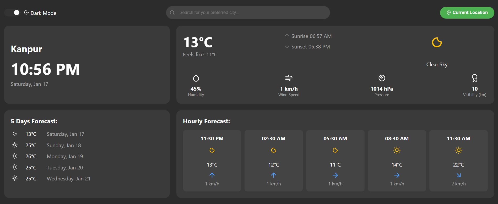

# 🌤 Weather Forecast App

A responsive **Weather Forecast App** built with **React.js** that provides real-time weather updates using the **OpenWeather API**. Users can view current weather, hourly forecasts, and a 5-day forecast for any city or their current location.

Live : [atmopeek](https://atmopeek.vercel.app/)

---

## 📸 Screenshot



---

## 🌟 Features

- **Current Weather:** Shows temperature, feels-like temperature, humidity, wind speed, pressure, visibility, and weather condition.  
- **Hourly Forecast:** Hour-by-hour weather updates for the next several hours.  
- **5-Day Forecast:** Overview of the weather for the upcoming 5 days.  
- **City Search:** Search for any city worldwide for weather updates.  
- **Current Location:** Detects user location for instant weather information.  
- **Dark Mode:** Toggle between light and dark themes.  
- **Responsive Design:** Works seamlessly on desktop and mobile devices.  

---

## 🛠 Technologies Used

- **Frontend:** React.js, HTML5, CSS3  
- **API:** [OpenWeather API](https://openweathermap.org/api)  
- **State Management:** React Hooks (`useState`, `useEffect`)  
- **HTTP Requests:** Fetch API  

---

## ⚡ Getting Started

### Prerequisites

- Node.js (>=14.x)  
- npm or yarn  
- OpenWeather API Key  

### Installation

1. Clone the repository:

```bash
git clone https://github.com/your-username/weather-forecast-app.git
cd weather-forecast-app
```

2. Install dependencies:

```bash
npm install
```

3. Create a `.env` file in the root directory and add your OpenWeather API key:

```env
VITE_WEATHER_API_KEY=your_api_key_here
```

4. Start the development server:

```bash
npm run dev
```

Open `http://localhost:5173` to view the app in your browser.

---

## 📝 Usage

- **Search City:** Enter a city name in the search bar to get weather information.
- **Current Location:** Click on "Current Location" to get local weather updates.
- **Hourly Forecast:** Scroll horizontally to see the hourly weather prediction.
- **5-Day Forecast:** Check the upcoming 5 days' weather in a summarized view.
- **Dark Mode:** Toggle the switch for light/dark theme.

---

## 🌐 API Reference

### Current Weather

```
GET https://api.openweathermap.org/data/2.5/weather?q={city name}&appid={API key}&units=metric
```

### 5-Day / 3-Hour Forecast

```
GET https://api.openweathermap.org/data/2.5/forecast?q={city name}&appid={API key}&units=metric
```

### Query Parameters

| Parameter | Description |
|-----------|-------------|
| `q` | City name (e.g. Delhi) |
| `appid` | Your API key |
| `units` | `metric` (°C) or `imperial` (°F) |

---

## 📂 Project Structure

```
weather-forecast-app/
├── app/
│   ├── App.css
│   ├── App.jsx
│   └── main.jsx
├── public/
│   ├── atmopeek.png
├── src/
│   ├── components/
│   │   ├── CurrentWeather.jsx
│   │   ├── DailyForecast.jsx
│   │   ├── HourlyForecast.jsx
│   │   ├── TopBar.jsx
│   │   ├── WeatherApp.jsx
│   │   ├── utils/
│   │   │   └── weatherUtils.jsx
│   │   └── icons/
│   │       └── WeatherIcons.jsx
├── .env
├── .gitignore
├── eslint.config.js
├── vite.config.js
├── index.html
├── package.json
└── README.md
```

---

## 👨‍💻 Author

**Raghav Awasthi**  
Frontend Developer | React.js Enthusiast

---
